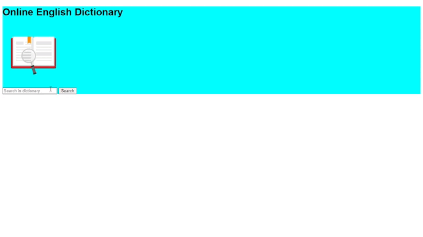

# Dicionário de inglês online

### Deploy no Netlify
https://online-english-dictionary.netlify.app/

## Sobre o projeto
O dicionário de inglês online se trata de um projeto simples utilizando HTML, CSS e JavaScript.

Nele é possível pesquisar os significados de inúmeras palavras e obtê-los em inglês. O resultado é apresentado da seguinte maneira:

- Phonetic: Pronúncia correta da respectiva palavra pesquisada
- Meanings: Lista de significados da palavra pesquisada

  

## Tecnologias utilizadas
- JavaScript 
- HTML 
- CSS 

## API utilizada (endpoint)
- https://api.dictionaryapi.dev/api/v2/entries/en/

## Entre em contato
  
- William Gomes

  
  
